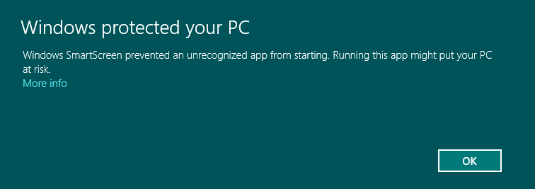
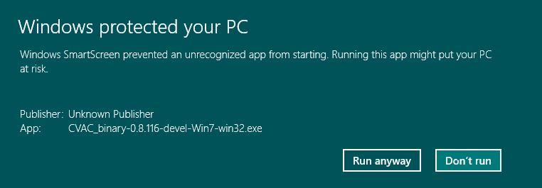
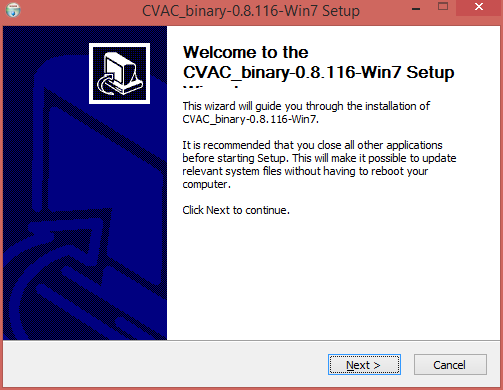
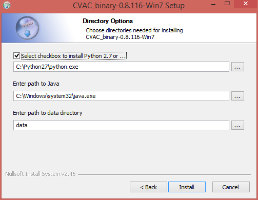
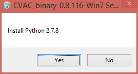
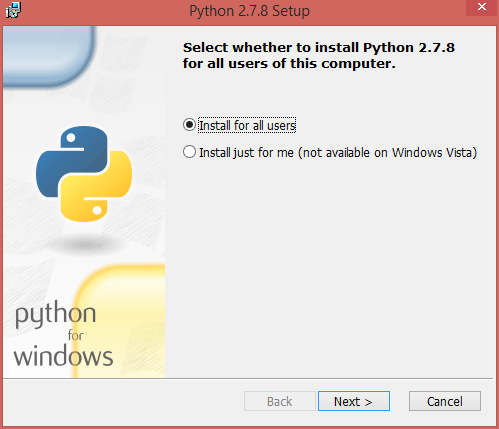
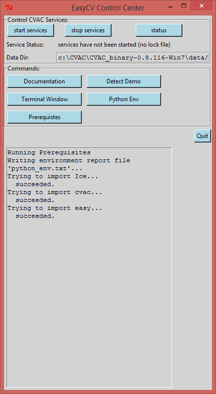
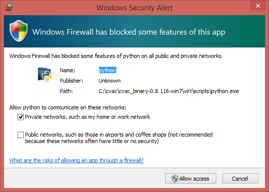

1. If you haven't yet, download the "master" branch [binary installer
for Windows](http://www.movesinstitute.org/~kolsch/CVAC/Download.php).
If there are Win7 and Win8 binaries, choose the correct one for your
operating system.  Windows XP users pick the Win7 version.  If there
is only one Windows binary, it will work on all Windows systems.
Click "Save," then "Run" in the following two dialogs:

2. Double-click the downloaded executable (called something like
CVAC_binary-0.8.99-Win7-win32.exe).  If you get a security warning
that looks as follows, click the highlighted "More info" text and select
"Run anyway" in the screen that opens up thereafter:

3. Follow the instructions in the Installer.

4. If you have a local installation of Python version 2.7 already, uncheck
the checkbox on the Directory Options dialog.  Otherwise, check the box so
that Python will be installed.

5. If Python needs to be installed, you have to have admin rights on
your machine.  You can try to separately install a Python with
settings that don't require Administrator's priviledges.  If you do
have admin rights, continue with the installation. 

8. After a short wait (up to 30 seconds), the EasyCV Control Center
graphical user interface will pop up.  Congratulations, you have
successfully installed EasyCV!

9. Pressing the "start" button will run a few default CV algorithms
(services) locally.  The first time you run this you might get
firewall warnings.  Select "Allow" for the Pyton and IceBox programs
so the services can accept service requests from clients.

10. Follow the [user documentation](user-documentation.html) on how to
get started.  If you have trouble installing EasyCV, please don't
hesitate to get in touch.