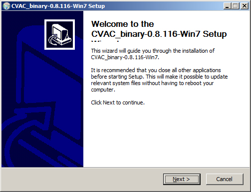
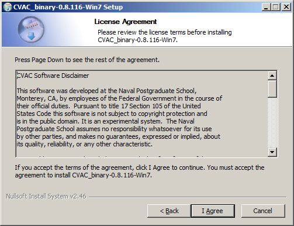
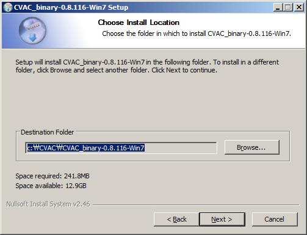
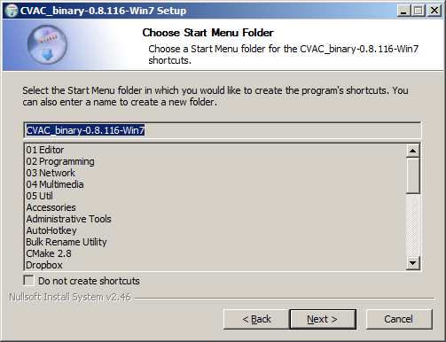
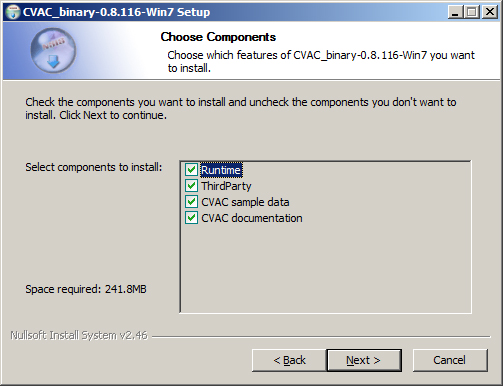
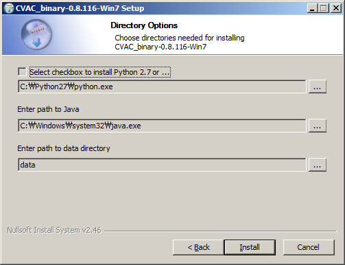
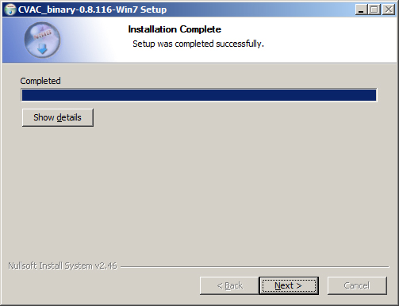
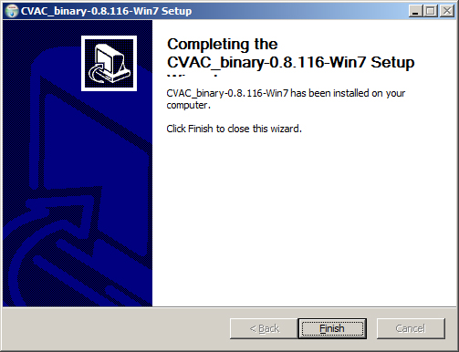
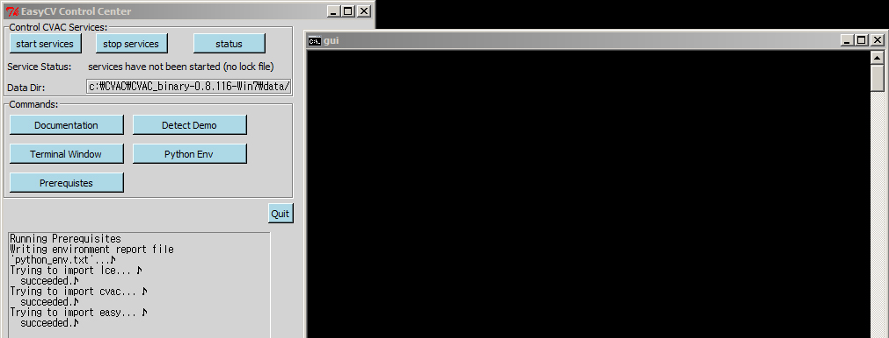
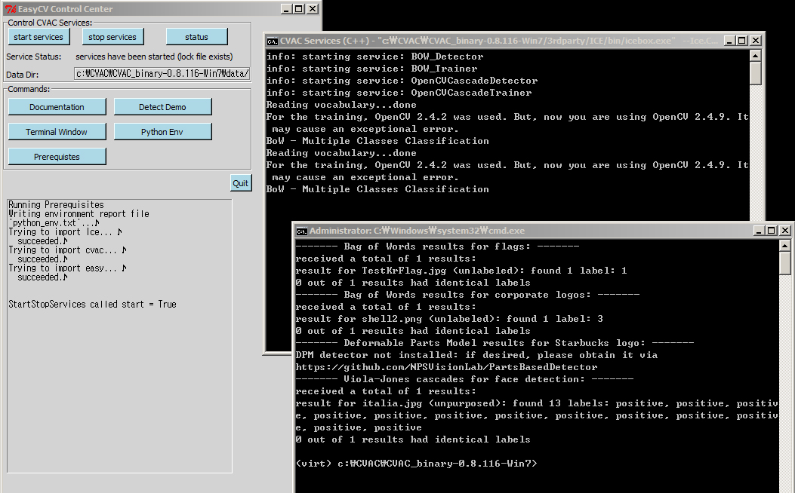

1. If you haven't yet, download the "master" branch [binary installer for
Win7](http://www.movesinstitute.org/~kolsch/CVAC/Download.php).

2. Double-click the downloaded disk image file (called something like
CVAC_binary-0.8.116-Win7-win32.exe).

3. Select "Next" for continuing the installation. 

4. Select "Next" if you agree the license agreement. 

5. Select "Next" after choosing install location. 

6. Select "Next" after choosing start menu folder. 

7. Select "Next" after choosing components. 

8. Select "Next" after setting up directory options. 
If you need to install Python, enable the option "Select checkbox to install Python 2.7 or ...".
If you enable this option, you will need Administrator rights to your
computer and you will have to follow the Python installation procedure.
Please see [here](installation_win.html) for additional instructions.
Then, automatically, next step will be continued. 

9. After about one minute, a "completed" screen will be shown. 

10. Select "Next" for finishing the installation. Congratulations, you have
successfully installed EasyCV! 

11. In Start Menu, select "CVAC_Binary-..." and then select "gui". 
Then, you will see the EasCV Control Center graphical user interface. 

12. Pressing the "start services" button and then the "detect demo" button 
will run a few default CV algorithms (services) locally.  

13. Follow the [user documentation](user-documentation.html) on how to
get started.  If you are having trouble installing EasyCV, please don't
hesitate to get in touch.
