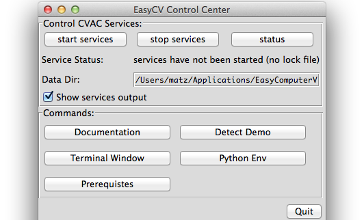
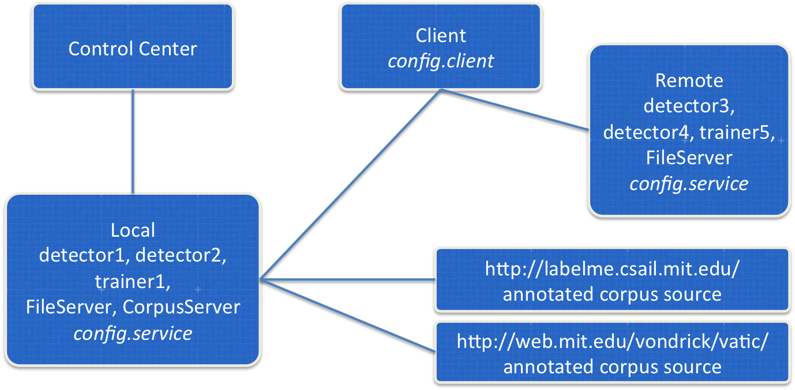

* [Quickstart](#quickstart)
* [Architecture](#architecture)
* [Service scripts](#scripts)
* [C/C++ Interfaces](#cpp)

Documentation version: if you are reading this online but you have
installed EasyCV on your computer, switch to your local documentation
as soon as possible.  Just click on "Documentation" in your
EasyCV Control Center (see below).  The version of the local documentation
matches your installed EasyCV version.
The [online documentation](http://npsvisionlab.github.io/CVAC)
refers to the EasyCV master branch.  Documentation for older versions
is available from EasyCV version 0.8 onwards and it is included with
the binary installer.  You can also [build](building.html) the
documentation from the source distribution.

# <a name="quickstart"></a> Quickstart

1. Double-click the EasyComputerVision application and wait for the
EasyCV Control Center to appear.  This might take up to a minute the
first time you start it.


1. Click the "start services" button. If you get firewall warnings,
select "Allow" so the services can accept the client's service
requests in the next step.

1. Click the "Detect Demo" button.  This will run a standard face
detector on a sample image and print the results.  If you have PIL
installed it will also pop up a window showing you the result.
*Done!*

## Run custom "easy" code in a Python shell

1. Click the "Terminal Window" button.  Once the window has opened,
change the current directory to the root installation folder, such as
<br>`cd /Applications/EasyComputerVision.app/Contents/Resources` or
<br>`cd C:\Program Files\EasyComputerVision` or
<br>`cd C:\CVAC\CVAC_binary-0.8.99-Win7`

1. Start an interactive Python shell by typing `python`.  At the \>\>\>
prompt, enter:

```python
import easy
detector = easy.getDetector( "OpenCVCascadeDetector" )
modelfile = "detectors/haarcascade_frontalface_alt.xml"
results = easy.detect( detector, modelfile, "testImg/weltmeister.jpg" )
easy.printResults(results)
```

## Apply the detector to your own image files

The algorithm services can only access images that are at or below the
"Data Dir" path that's shown in the Control Center (mouse-over and
scroll for the complete path).  You can either manually copy your
images to that path, or you can use the FileServer service to
accomplish this task for you.  Again, in the Python shell, execute
the following code, replacing "testImg" with a path to your images
or image folder:

```python
import easy
rs = easy.createRunSet( "testImg" )
easy.printRunSetInfo( rs, printLabels=True )
fileserver = easy.getFileServer( "PythonFileService:default -p 10111 " )
putResult = easy.putAllFiles( fileserver, rs )
detector = easy.getDetector( "BOW_Detector" )
modelfile = "detectors/bowUSKOCA.zip"
results = easy.detect( detector, modelfile, rs )
rmResult = easy.deleteAllFiles( fileserver, putResult )
easy.printResults(results)
```

## Further Tutorials and Demos

Please refer to the list of [demos](demos.html) for additional tasks
such as training a detector for your particular objects of interest,
using LabelMe or VATIC annotations, running against remote services,
creating ROC curves, or comparing algorithm performance.  If something
is not working as expected, check the
[Troubleshooting](troubleshooting.html) page.
For more documentation, see also the links on the [main page](index.html).


# <a name="architecture"></a> Architecture

EasyCV is a multi-process client-server architecture.  Your _Easy!_
code runs as client and connects to algorithm _services_.  



Pressing the "start" button will run a few default CV algorithms
(services) locally, including detectors, trainers for detectors, a
file server and a corpus server.

Take note of the service's "data" directory.  That's where media files
need to be located in order to be accessible to the services.  If you
have them in another machine, you need to "upload" them to the
FileServer first.  If you would like to change this folder, you need
to edit the config.services file in the Application's directory.

The "data" directory is specified with the CVAC.DataDir property in
both the config.client and config.service files.  For local clients
and services, it is convenient to make this the same directory.

Take a look at the underlying
[easy.py](html/namespaceeasy_1_1easy.html) library implementation if
you want to see the CVAC metadata structure and observe bare-bones
interaction between clients and services.

BagOfWordsUSKOCA is specified in config.client as a service running
locally, listening on port 10104.  This must correspond to the port
number specified in config.service.  This particular service is a
pre-trained detector.  The learned model for US, Korean, and Canadian
flags is stored in the file specified with
`BagOfWordsUSKOCA.DetectorFilename = bowUSKOCA.zip`.

Stop the services in your EasyCV Control Center.


# <a name="scripts"></a> Service Scripts

You can start and stop the local services without the EasyCV Control
Center graphical user interface.  The startServices and stopServices
scripts are provided in the application's directory.  That is:

On the MAC:
<br>`/Applications/EasyComputerVision.app/Contents/Resources/bin/startServices.sh`
<br>`/Applications/EasyComputerVision.app/Contents/Resources/bin/stopServices.sh`

On Windows:
<br>`C:\EasyCV\CVAC_binary-0.X.XX-Win7\bin\startServices.bat`
<br>`C:\EasyCV\CVAC_binary-0.X.XX-Win7\bin\stopServices.bat`


# <a name="cpp"></a> C/C++ Interfaces

If the Easy! library and Python are not your thing, you can also run one of the C/C++ examples and, for example, test files in a directory "data/CTest" with one of the algorithms:

`bin/detectorClient BagOfWordsUSKOCA CTest config.client`

`bin/detectorClient NpsBagOfWordsUSKOCA CTest config.client`

*Nps*BagOfWordsUSKOCA is specified in config.client as a service
running on vision.nps.edu, listening on port 10104.  This is a service
with the same pre-trained detector, so you should get the same results
as above.  This time, however, the processing happens on the remote
server.

