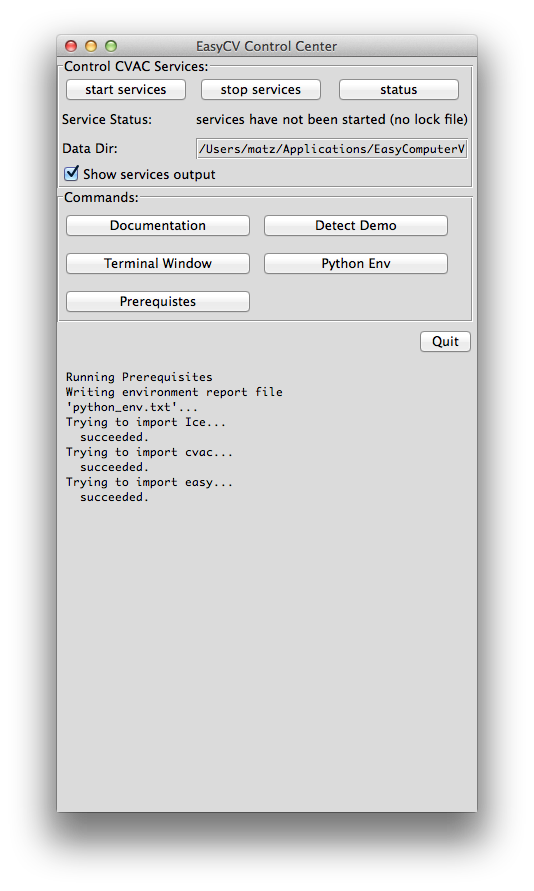

1. If you haven't yet, download the "master" branch [binary installer for
Darwin](http://www.movesinstitute.org/~kolsch/CVAC/Download.php).

2. Double-click the downloaded disk image file (called something like
CVAC_binary-0.8.99-Darwin.dmg).

3. Drag the "EasyComputerVision" icon into the Applications folder.
Alternatively...

4. If you do not have admin rights, drag the icon into your user-specific
~/Applications folder instead: In Finder, press Shift-Command-H, then
select Applications.

5. Browse to the Applications folder (by double-clicking it).
Right-click EasyComputerVision and select "Open".

6. In the warning dialog, select "Open".

7. If you get an error message, go back to step 5.

8. After a short wait (up to 30 seconds), the EasyCV Control Center
graphical user interface will pop up.  Congratulations, you have
successfully installed EasyCV!

9. Follow the [user documentation](user-documentation.html) on how to
get started.  If you have trouble installing EasyCV, please don't
hesitate to get in touch.