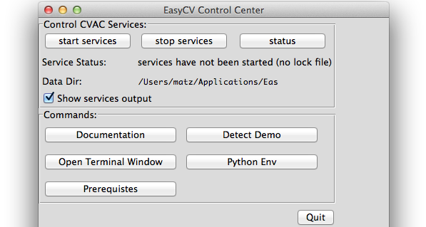
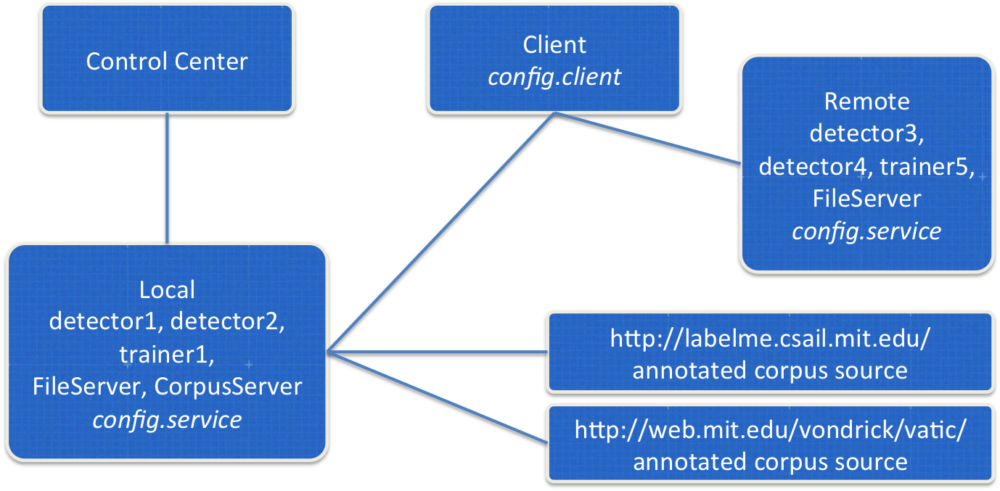

Contents:

* [Quickstart](#quickstart)
* [Architecture](#architecture)
* [FileServer](#fileserver)

Documentation version: if you are reading this from a local file, the
version of the documentation matches your installed EasyCV version.
Otherwise, the [online documentation](http://npsvisionlab.github.io/CVAC)
refers to the EasyCV master branch.  Documentation for other versions
is available from EasyCV version 0.8 onwards and it is included with
the binary installer.  You can also [build](building.html) the
documentation from the source distribution.

# <a name="quickstart"></a> Quickstart

1. Double-click the EasyComputerVision application and wait for the
EasyCV Control Center to appear.  This might take up to a minute the
first time you start it.


1. Click the "start services" button. If you get firewall warnings,
select "Allow" so the services can accept the client's service
requests in the next step.

1. Click the "Detect Demo" button.  This will run a standard face
detector on a sample image and, if you have PIL installed, pop up a
window showing you the result.  Done!

## Run custom "easy" code in a Python shell

1. Click the "Terminal Window" button.  Once the window has opened,
change the current directory to the root installation folder, such as
<br>`cd /Applications/EasyComputerVision.app/Contents/Resources` or
<br>`cd C:\Program Files\EasyComputerVision`

1. Start an interactive Python shell by typing `python`.  At the \>\>\>
prompt, enter:

```python
    import easy
    detector = easy.getDetector( "OpenCVCascadeDetector" )
    modelfile = "detectors/haarcascade_frontalface_alt.xml"
    results = easy.detect( detector, modelfile, "testImg/weltmeister.jpg" )
    easy.printResults(results)
```

## Apply the detector to some of your own image files

The algorithm services can only access images that are at or below the
"Data Dir" path that's shown in the Control Center (mouse-over and
scroll for the complete path).  You can either manually copy your
images to that path, or you can use the FileServer service to
accomplish this task for you.  Again, in the Python shell, execute
the following code, replacing "testImg" with a path to your images
or image folder:

```python
import easy
rs = easy.createRunSet( "testImg" )
easy.printRunSetInfo( rs, printLabels=True )
fileserver = easy.getFileServer( "PythonFileService:default -p 10111 " )
putResult = easy.putAllFiles( fileserver, rs )
detector = easy.getDetector( "BOW_Detector" )
modelfile = "detectors/bowUSKOCA.zip"
results = easy.detect( detector, modelfile, rs )
rmResult = easy.deleteAllFiles( fileserver, putResult )
easy.printResults(results)
```

## Further Tutorials and Demos

Please refer to the list of [demos](demos.html) for additional tasks
such as training a detector for your particular objects of interest,
using LabelMe or VATIC annotations, running against remote services,
creating ROC curves, or comparing algorithm performance.

# <a name="architecture"></a> Architecture

## EasyCV Control Center

Start up the EasyCV Control Center (see the [installation
notes](download.html) for instructions on how to do that).  

Take note of the service's "data" directory.  That's where media files
need to be located in order to be accessible to the services.  If you
have them in another folder, you need to "upload" them to the
FileServer first.  If you would like to change this folder, you need
to edit the config.services file in the Application's directory.

If you haven't already, start with a [high-level
introduction](http://movesinstitute.org/~kolsch/CVAC/index.html) to
Easy! Computer Vision, a glance at the [Frequently Asked
Questions](http://movesinstitute.org/~kolsch/CVAC/faq.html), and the
overview of a [Tutorial at CVPR
2013](http://movesinstitute.org/~kolsch/CVAC/tutorial.html).

Pressing the "start" button will run a few default CV algorithms
(services) locally.  If you get firewall warnings, select "Allow" so
the services can accept service requests from clients.




Then take a look at the [demo directory](https://github.com/NPSVisionLab/CVAC/tree/devel/demo) which explains most of the features of the high-level Easy! library in simple "mini-tutorials."  You can also see these mini tutorials and their program output [here](http://movesinstitute.org/~kolsch/CVAC/Easy.pdf).  It shows you how to run a detector on files and directories, how to train a detector, how to connect to remote services, and many more things.  Take a look at the underlying `easy.py` library implementation if you want to see the CVAC metadata structure and observe bare-bones interaction between clients and services.

BagOfWordsUSKOCA is specified in config.client as a service running locally, listening on port 10104.  This must correspond to the port number specified in config.service.  This particular service is a pre-trained detector.  The learned model for US, Korean, and Canadian flags is stored in the file specified with `BagOfWordsUSKOCA.DetectorFilename = bowUSKOCA.zip`.

The "data" directory is specified with the CVAC.DataDir property in both the config.client and config.service files.  For local clients and services, this will always be the same directory.  "CTest" is a subdirectory in the CVAC.DataDir.

Stop the services in your EasyCV Control Center.

## Remote services

Test your client against a pre-installed test service:

# Command line and C/C++

If the Easy! library and Python are not your thing, you can also run one of the C/C++ examples and, for example, test files in a directory "data/CTest" with one of the algorithms:

`bin/startIcebox.sh`

`bin/detectorClient BagOfWordsUSKOCA CTest config.client`

`bin/detectorClient NpsBagOfWordsUSKOCA CTest config.client`

`bin/stopIcebox.sh`

**Nps**BagOfWordsUSKOCA is specified in config.client as a service running on vision.nps.edu, listening on port 10104.  This is a service with the same pre-trained detector, so you should get the same results as above.  This time, however, the processing happens on the remote server.

# Troubleshooting

See the [Troubleshooting](troubleshooting.html) page.